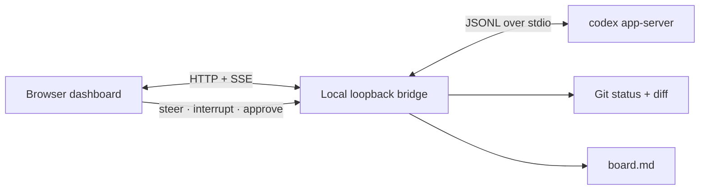

<div align="center">


# WatchingCodex

**See what Codex is doing. Steer before it drifts.**

A local-first control room for OpenAI Codex: live activity, plans, diffs, approvals, steering, interrupts, and drift signals in one browser tab.

[简体中文](./docs/README.zh-CN.md) · [Architecture](./docs/architecture.md) · [Contributing](./CONTRIBUTING.md) · [Security](./SECURITY.md)

[](https://github.com/RektonLee/WatchingCodex/actions/workflows/ci.yml)
[](./LICENSE)
[](https://nodejs.org/)
[](#security-model)

</div>

## Why WatchingCodex?

Long agent turns are hard to follow from a terminal. A manually maintained `board.md` helps with intent, but it cannot tell you what command is running, what files changed, whether the agent is looping, or let you intervene at the right moment.

WatchingCodex connects to the official Codex App Server event stream and turns operational evidence into a control surface:

- **Live trace** — commands, tools, agent updates, file edits, and failures as structured cards.
- **Plan view** — follow Codex's current plan and step status without reading raw logs.
- **Workspace diff** — tracked, staged, and untracked text changes in a focused inspector.
- **Steer mid-turn** — append a correction to the active turn instead of waiting for it to finish.
- **Hard interrupt** — request cancellation through `turn/interrupt`.
- **Inline approvals** — accept or decline command and file-change requests in context.
- **Drift signals** — surface unusually broad changes, deletions, large removals, dependency edits, repeated command failures, and quiet turns.
- **Board compatibility** — keep using `board.md`, but treat live events as the source of truth.
- **Bilingual UI** — English and Simplified Chinese, remembered locally in your browser.

WatchingCodex does **not** attempt to expose hidden chain-of-thought. It shows the safer and more useful thing: observable actions, artifacts, status, and verification evidence.

## Quick start

### Prerequisites

- Node.js 20.19 or newer
- [OpenAI Codex CLI](https://github.com/openai/codex) installed and signed in
- Git available for workspace diff inspection

### Run from source

```bash
git clone https://github.com/RektonLee/WatchingCodex.git
cd WatchingCodex
npm install
npm run build
npm start -- /path/to/your/project
```

WatchingCodex opens `http://127.0.0.1:7331` automatically. To keep it from opening a browser:

```bash
node bin/watching-codex.mjs /path/to/your/project --no-open
```

For development with hot reload:

```bash
npm run dev -- /path/to/your/project
```

The development UI runs at `http://127.0.0.1:5173` and proxies the local bridge on port `7331`.

## How it works



The browser never talks directly to Codex credentials or a public socket. A small Node.js bridge owns the App Server child process, stores current in-memory UI state, watches Git, and serves the compiled dashboard from the same loopback origin.

See [the architecture note](./docs/architecture.md) for event mapping and trust boundaries.

## CLI

```text
watching-codex [workspace] [options]

Options:
  -p, --port <number>  Local port (default: 7331)
      --no-open        Do not open a browser automatically
  -v, --version        Print the version
  -h, --help           Show help
```

After cloning, run `npm link` if you want the `watching-codex` and `codex-watch` commands available globally on your machine.

## Security model

- The server binds only to `127.0.0.1`; there is no LAN listener.
- State stays in memory and project data stays on your machine.
- POST controls validate the browser origin.
- Static responses include a restrictive Content Security Policy and deny framing.
- The bridge passes approvals back to Codex rather than silently bypassing its permission model.
- WatchingCodex can execute Codex against the selected workspace. Review third-party changes before installing or running forks.

Do not expose the dashboard with a public tunnel unless you add strong authentication in front of it. See [SECURITY.md](./SECURITY.md) for reporting and deployment guidance.

## Current limitations

- Full monitoring and control apply to sessions started or resumed through this WatchingCodex process. It does not silently take over an already-running turn owned by another Codex Desktop or CLI process.
- Thread history comes from Codex, but you should only resume a thread that is no longer running elsewhere.
- Binary and very large untracked files appear in the file list without an inline diff.
- App Server evolves with Codex. WatchingCodex uses the stable API surface and keeps experimental features disabled.

## Roadmap

- [ ] Publish the signed npm package for `npx watching-codex`
- [ ] Reconnectable event history and session replay
- [ ] Worktree-aware checkpoints and safe restore previews
- [ ] Test/build result grouping with verification badges
- [ ] Optional authenticated remote access
- [ ] Plugin adapter layer for other coding agents without flattening Codex-native events

Open an [issue](https://github.com/RektonLee/WatchingCodex/issues) if one of these would change your workflow.

## Development

```bash
npm install
npm run check
```

`npm run check` runs linting, Node tests, TypeScript compilation, and the production build. The server tests run without a Codex account.

## Acknowledgements

WatchingCodex is built on the official [OpenAI Codex App Server](https://github.com/openai/codex/tree/main/codex-rs/app-server). It is an independent open-source project and is not affiliated with or endorsed by OpenAI.

## License

[MIT](./LICENSE) © RektonLee
