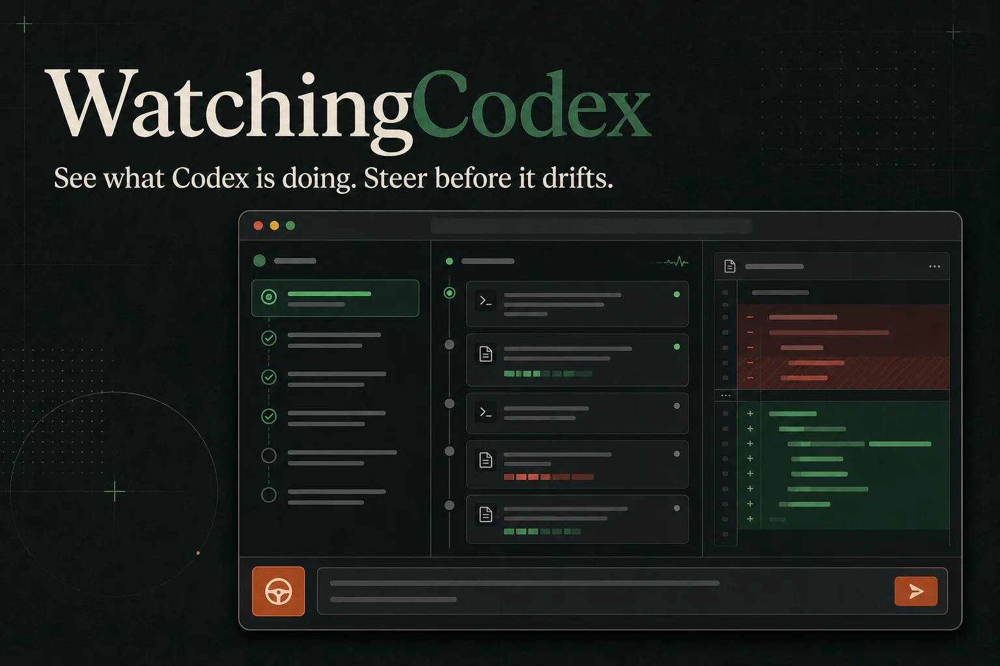

<div align="center">



# WatchingCodex

**看清 Codex 在做什么，在跑偏之前及时纠正。**

一个 local-first 的 Codex 控制台：把实时活动、计划、diff、审批、纠偏、中断和偏航信号放进同一个浏览器页面。

[English](../README.md) · [架构](./architecture.md) · [参与贡献](../CONTRIBUTING.md) · [安全说明](../SECURITY.md)

</div>

## 它解决什么问题

Codex 跑长任务时，仅看终端很难判断它正在做什么。`board.md` 能保存目标，但无法实时告诉你当前命令、文件变化、失败循环，也不能在恰当的时间让你介入。

WatchingCodex 直接连接 Codex App Server 的事件流，提供：

- 命令、工具、文件修改和失败状态的实时活动流
- Codex 当前计划及步骤状态
- Git 已跟踪、暂存和未跟踪文本文件的 diff
- 当前 turn 运行中直接追加纠偏要求
- 通过 `turn/interrupt` 真正请求中断
- 在上下文中允许或拒绝审批请求
- 大范围修改、删除、依赖变化、重复失败和长时间无活动等偏航信号
- 继续显示 `board.md`，但不再把它当作唯一事实来源
- 中英文 UI，语言偏好只保存在本地浏览器

它不会试图恢复隐藏思维链，而是展示更可靠的操作证据：做了什么、改了什么、当前状态和验证结果。

## 快速开始

准备 Node.js 20.19+、Git，以及已经登录的 [Codex CLI](https://github.com/openai/codex)：

```bash
git clone https://github.com/RektonLee/WatchingCodex.git
cd WatchingCodex
npm install
npm run build
npm start -- /你的项目路径
```

页面会自动打开在 `http://127.0.0.1:7331`。如果不希望自动打开浏览器：

```bash
node bin/watching-codex.mjs /你的项目路径 --no-open
```

开发模式：

```bash
npm run dev -- /你的项目路径
```

## 重要边界

- 完整实时监控和控制适用于从当前 WatchingCodex 进程启动或恢复的会话。
- 它不会旁路接管另一个 Codex Desktop/CLI 进程中已经运行到一半的 turn。
- 只应恢复已经停止、没有被其他进程占用的历史会话。
- 服务默认只监听 `127.0.0.1`，不要在没有认证的情况下通过公网隧道暴露。

更多内容请查看[英文主 README](../README.md)和[架构说明](./architecture.md)。
